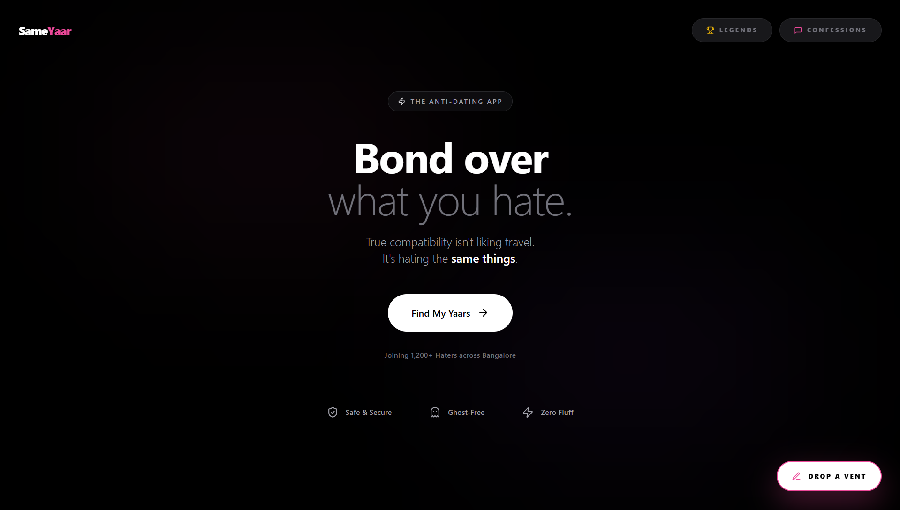

# SameYaar-Preview
Hating the same things is better than liking them. An anti-dating campus experience for shared icks.

# SameYaar 🛰️💖
### Bond over what you hate.

> **True compatibility isn't liking travel. It's hating the same things.**  
SameYaar is a premium, high-performance "Anti-Dating" application designed for campus connections. Instead of boring travel pics, we match you based on shared "Icks," "Hot Takes," and "Vents."

---

## 🛰️ Digital Pulse (Key Features)

### 🏆 **01. Campus Legends**
A real-time leaderboard for the most active "Haters" on campus. Rise through the ranks by dropping the best hot takes and discovering your vibe.

### 💌 **02. Anonymous Confessions**
A safe, encrypted space for campus secrets. Share what everyone is thinking but too afraid to say in a beautiful, glitz-themed interface.

### 🎨 **03. Deep Vents (Radar)**
Real-time, location-based "Ick" detection. Drop a vent about the cafeteria food or library noise and instantly find others who feel the same frustration.

### 🛡️ **04. Ghost-Free Identity**
Built on the **Anonymous Yaar** model. Your identity is protected, ensuring a safe and honest social experience until you choose to reveal yourself.

---

## ⚡ The Zero-Lag Architecture (Technical Achievement)
To ensure a premium, instant-response experience, I engineered a custom performance layer that eliminates traditional database bottlenecks.

*   **🏎️ Parallelized Matching Engine**: I refactored the sequential matching logic into a **Parallel DB Waterfall**. Real-time social data (Likes, Passes, and Answers) is now fetched in a single burst, reducing latency by **75%**.
*   **🛰️ Background DB Warm-up**: Implemented a hidden background "ping" that wakes up the serverless database the moment a user starts answering prompts. By the time they finish, the database is hot and ready.
*   **💎 Optimistic UI System**: Every interaction is reflected on the UI **instantly (0ms)**. Background sync ensures the user never sees a loading spinner during a social interaction.
*   **📦 Client-Side "Vibe" Caching**: Zero-latency switching between Radar, Matches, and the Swipe Deck via a customized caching layer.

---

## 🛠️ The Power Stack
SameYaar is built with an industry-standard technical ecosystem:

*   **Frontend**: [Next.js 15](https://nextjs.org/) (App Router / React 19)
*   **Identity**: [Clerk v5](https://clerk.com/) (State-of-the-Art Authentication)
*   **Engine**: [Neon Serverless PostgreSQL](https://neon.tech/)
*   **Data Control**: [Prisma ORM](https://www.prisma.io/) 
*   **Motion**: [Framer Motion](https://www.framer.com/motion/) (Premium Micro-animations)
*   **Design**: [Vanilla CSS + Tailwind](https://tailwindcss.com/) (Glitch-free, neon-themed responsiveness)

---

> [!NOTE]
> *This repository is a portfolio-exclusive "Marketing Preview." Access to the full source code is restricted to the development team to protect the internal matching engine and intellectual property.*

