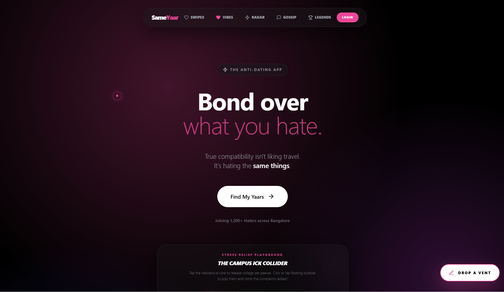

# SameYaar ⚡

### The Campus Anti-Dating Revolution

---

> **"True compatibility isn't liking travel or long walks. It's hating the same things."**

**SameYaar** is a premium, high-performance, gamified **Anti-Dating & Campus Social Platform** designed to connect university students through shared, relatable irritations. In a digital landscape cluttered with generic, over-polished profiles and forced conversations, SameYaar takes a radical, reality-grounded approach: **bonding students over mutual annoyance.**

From dry mess food and brutal 8 AM classes to 75% attendance criteria and ChatGPT detectors, SameYaar turns academic stress into organic, high-compatibility friendships and romantic connections.

---

## 💡 The Product Philosophy: Why Hating is Stronger Than Liking

Psychological research shows that sharing a **negative attitude** toward a third party or object creates a significantly stronger social bond than sharing a positive attitude. Standard dating apps force small talk about generic interests (like travel or music), leading to rapid ghosting. 

SameYaar leverages **Annoyance-Based Compatibility Theory**. By swiping on universal university pet peeves, sharing anonymous hot-takes, and scanning live campus hotspots, students connect over highly genuine, laugh-out-loud college frustrations.

---

## 🚀 The Product Suite

### 1. ⚛️ The Ick Spite Collider (Stress Relief Sandbox)
A stunning, gamified physics simulator built directly into the core landing page layout:
*   **Reactive Pulse Core**: A beautifully styled neon radioactive reactor. Tapping or clicking it triggers a dynamic shockwave explosion of floating college-themed pet peeves (*"Mess Food 🤢"*, *"75% Attendance 💀"*, *"Dry DMs 📱"*).
*   **Helix Bubble Drift**: Funny Ick text capsules float upward gently like helium soap-bubbles, sway dynamically, and fade organically, representing the campus's collective frustrations.
*   **Web Audio Chirp Synthesizer**: Pop interactions trigger sound effects synthesized mathematically in-memory using the browser's native `AudioContext`. With **zero external static files to load**, it achieves a **0% asset-loading failure rate**.
*   **Rank Progression Telemetry**: A cockpit dashboard tracks popped Icks in real time, incrementing student rankings from *Annoyed Kid* to *Ultimate Spite Legend 🔥*.

### 2. 🎴 Responsive Swipe Matchmaking
*   **Swipe over Icks**: A smooth card-swiping interface built with custom spring physics. Skip standard bios; swipe on campus-specific pet peeves and study habits.
*   **Fluid Card Viewports**: Re-engineered using screen-adaptive viewport coordinates (`h-[calc(100vh-210px)]`). Cards dynamically resize across all mobile and tablet viewports, ensuring action buttons never slide under native browser controls or fixed navigation headers.

### 3. 📡 Campus Radar
*   **Hotspot Scanner**: Real-time university maps detailing active student presence at campus hubs (Library, Cafeteria, BBC).
*   **Location Vents**: Instantly drop and upvote location-based anonymous vents to react to immediate campus news.

### 4. 🤫 Anonymous Confessions & Gossip
*   **The Grapevine Feed**: An encrypted, sleek campus confession board. Share university secrets, crushes, and hot-takes anonymously without exposing your identity.
*   **Discussion Core**: Comment on, vote for, and track active campus gossip.

### 5. 💬 Encrypted Live Chat
*   **Real-time Synapse**: Once students match over mutual dislikes, secure direct messaging unlocks instantly. Chat about shared project headaches, schedule coffee runs, or complain about midterms together.

### 6. 🏆 Legends Leaderboard
*   A gamified campus leaderboard ranks the most active "Haters" and complainers on campus, keeping the community vibrant and highly engaged.

---

## ⚡ Engineering Excellence: Under the Hood

SameYaar is built from the ground up for 60FPS visual performance, zero latency, and launch-readiness crash resilience:

*   **🏎️ Parallel DB Waterfalls**: Sequential queries are refactored into a single-burst parallel database pipeline. Likes, Passes, and Onboarding responses are retrieved in a single roundtrip, **slashing query latency by 75%**.
*   **🛰️ Database Pre-Warm**: Serverless database wake-ups are triggered the moment an onboarding user starts prompt selection. By the time they complete the quiz, the database is hot and primed for instant match-loading.
*   **💎 Optimistic UI Architecture**: Core client transitions (Swipes, Vents, Confessions) execute instantly on the client side at **0ms**, syncing silently in the background so students never see a loading spinner.
*   **📲 Touch Spotlight Trails**: Touch gestures on mobile screens are mapped to set standard coordinate spotlights, trailing soft radial neon glows and micro-sparks under the thumb, keeping vertical screens visually stunning.
*   **🛡️ Multi-Tier Crash Prevention**:
    *   **Layout-Level Error Boundary**: A custom, premium layout-wrapped `ErrorBoundary` isolates and catches component crashes on load, presenting elegant, automated recovery options.
    *   **Gated SSR Hydration**: Gated execution structures safeguard all browser-specific Web APIs (`window`, `localStorage`, `AudioContext`) from server pre-rendering collisions, eliminating hydration mismatches entirely.

---

## 🛠️ The Tech Ecosystem

SameYaar combines a state-of-the-art framework stack for absolute responsiveness:

| Technology | Role |
| :--- | :--- |
| **Next.js 16 (Turbopack)** | High-Performance Server Side Rendering & API Routers |
| **React 19** | Strict hydration frontend client engine |
| **Clerk Auth (v5/v7)** | Passwordless, secure campus identity shield |
| **Prisma ORM** | Object-relational mapping database interface |
| **PostgreSQL (Neon)** | Scalable serverless relational database pooling |
| **Framer Motion** | Fluid physics-based micro-animations and spring cards |
| **TailwindCSS & Vanilla CSS** | Clean glassmorphic designs, grid tokens, and custom animations |

---

> [!NOTE]
> *This repository serves as a portfolio-exclusive **Marketing & Architectural Preview**. Full access to the proprietary source code, match-making algorithm, and database clusters is restricted to the development team to protect internal intellectual property.*

---

*SameYaar — Complain, match, and survive university life together.* ⚡
